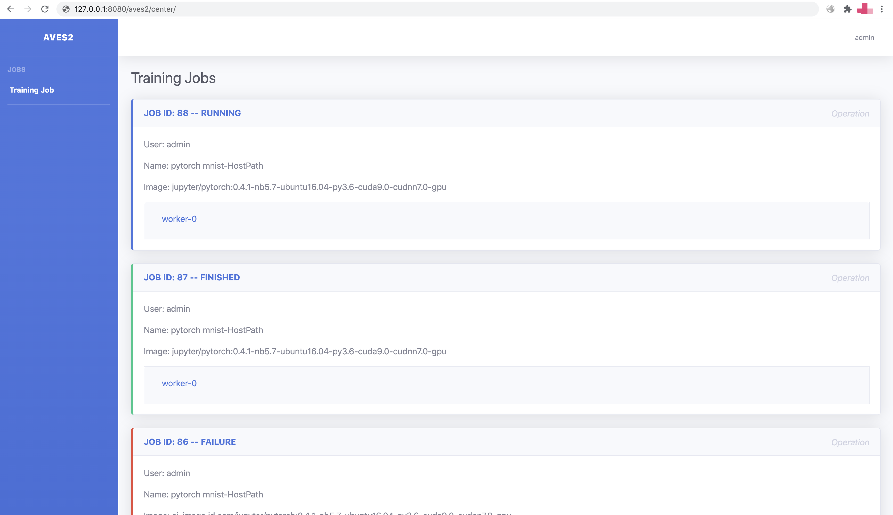

# [Aves2](https://github.com/jd-aig/aves2)
Aves2是一个分布式机器学习模型训练引擎，支持用户提交训练任务到Kubernetes或docker swarm集群。


## 软件包依赖
- django==2.2
- djangorestframework==3.9.1
- django-filter==2.1.0
- django-mysql==2.4.1
- celery==4.2.1
- celery_once==2.0.0
- django_celery_results==1.0.4
- redis==3.2.0
- kubernetes==9.*
- mysqlclient==1.4.2
- jsonschema==3.0.2
- jinja2
- escapism
- pika
- gevent

## 部署依赖
- Kubernetes集群或docker swarm集群
- NFS（可选）
- 对象存储（可选）
- MySQL数据库
- Redis数据库（可选）
- RabbitMQ

## 制作镜像
```
    cd aves2/
    docker build -t <image> -f docker/Dockerfile .
```

## 基于docker swarm部署
如果您已有swarm集群，可以修改docker-compose文件中aves2镜像后直接使用。
对于单机环境，也可以初始化一个单节点swarm环境进行使用。

### 初始化swarm集群
```
    docker swarm init --advertise-addr <Your Node IP>
```

### 创建network aves2-sys
aves2启动的训练容器均会绑定创建的aves2-sys网络
```
    docker network create aves2-sys --attachable --driver overlay --scope swarm
```

### 修改docker-compose.yaml并部署
项目中提供了一个可以直接使用的docker-compose文件，提供了mysql、rabbitmq等基础服务。
用户制作镜像后更新docker-compose中aves2的镜像地址即可使用。
```
    docker stack  deploy aves2 -c docker-compose.yaml
```


## 基于kubernetes部署

### 安装helm
```
    kubectl create serviceaccount --namespace=kube-system tiller
    kubectl create clusterrolebinding tiller-cluster-rule --clusterrole=cluster-admin --serviceaccount=kube-system:tiller
    helm init --upgrade -i registry.cn-hangzhou.aliyuncs.com/google_containers/tiller:v2.14.3 --stable-repo-url http://mirror.azure.cn/kubernetes/charts/ --service-account=tiller
```

### 安装[NFS Provisoner](https://github.com/kubernetes-incubator/external-storage/tree/master/nfs-client)
Aves2支持用户使用PVC作为存储进行训练，如果需要运行分布式任务，则需要使用支持**ReadWriteMandy**的PVC。
```
    git clone https://github.com/helm/charts.git
    cd charts
    helm install --name nfs-client-provisioner --set storageClass.name=<storage class name> --set nfs.server=<IP Addr> --set nfs.path=</exported/path> stable/nfs-client-provisioner
```

### 集群节点挂载NFS
Aves2支持用户使用hostpath作为存储进行训练。
如果使用NFS作为存储，则需要将NFS挂载到各个节点，如/mnt/nfs。各用户目录分配在/mnt/nfs/users/下。
```
    mount -t nfs -o lookupcache=none,vers=3,noresvport <IP Addr>:</exported/path>/ /mnt/nfs/
```

### 安装Aves2
```
    helm install --name <my-release> helm/aves2/
```

### 配置

| Parameter                           | Description                 | Default                |
| ----------------------------------- | --------------------------- | -----------------------|
| `oss.enableOss`                     | 是否支持对象存储               | `no`                   |
| `oss.accessKeyId`                   | OSS Access key              | `null`                 |
| `oss.secretKeyId`                   | OSS Secret key              | `null`                 |
| `oss.endpoint`                      | OSS endpoint                | `null`                 |
| `rabbitmq.host`                     | RabbitMQ Addr               | `IfNotPresent`         |
| `rabbitmq.user`                     | RabbitMQ user               | `nfs-client`           |
| `rabbitmq.pass`                     | RabbitMQ password           | `false`                |
| `rabbitmq.reportExchange`           | RabbitMQ exchange           | `true`                 |
| `rabbitmq.reportExchangeType`       | RabbitMQ exchange type      | `Delete`               |
| `rabbitmq.reportExchangeRoutingKey` | RabbitMQ routing key        | `null`                 |
| `celery.brokerUrl`                  | Message broker addr         | `true`                 |
| `celery.defaultQueue`               | default celery task queue   | `celery`               |
| `celery.concurrency`                | celery concurrency          | `10`                   |
| `mysql.host`                        | Database host               | `null`                 |
| `mysql.port`                        | Database port               | `3306`                 |
| `mysql.dbName`                      | Database name               | `aves2`                |
| `mysql.user`                        | Database user               | `null`                 |
| `mysql.pass`                        | Database password           | `null`                 |
| `ingress.hosts`                     | Ingress host                | `[]`                   |

可以通过指定values文件安装, 更多配置项参考**helm/aves2/values.yaml**:

`
    helm install --name <my-release> -f values.yaml helm/aves2/
`

## 使用
### 提交任务
参考aves2-client文档

### 查看任务

